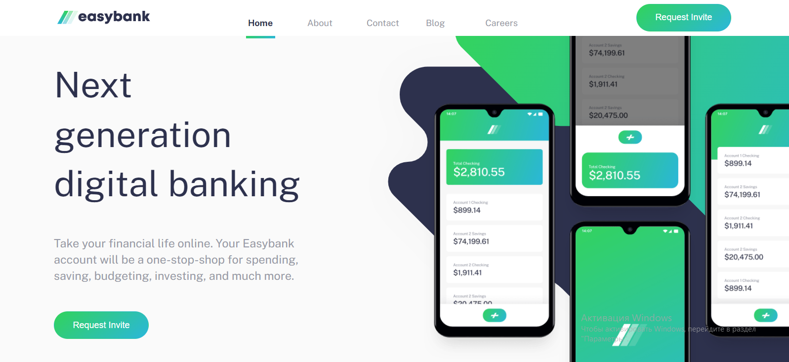

# Frontend Mentor - Easybank landing page solution

This is a solution to the [Easybank landing page challenge on Frontend Mentor](https://www.frontendmentor.io/challenges/easybank-landing-page-WaUhkoDN).

## Overview

### The challenge

Users should be able to:

- View the optimal layout for the site depending on their device's screen size
- See hover states for all interactive elements on the page

### Screenshot

### Links

- Solution URL: [Add solution URL here](https://github.com/InnaTymoshenko/esybank)
- Live Site URL: [Add live site URL here](https://esybank.vercel.app/)

## My process

### Built with

- Semantic HTML5 markup
- CSS custom properties
- Flexbox
- CSS Grid
- Mobile-first workflow
- [React](https://reactjs.org/) - JS library
- Typescript

## Author

- Website - [Tymoshenko Inna](https://itymoshenko.vercel.app/)
- Frontend Mentor - [@InnaTymoshenko](https://www.frontendmentor.io/profile/yourusername)
